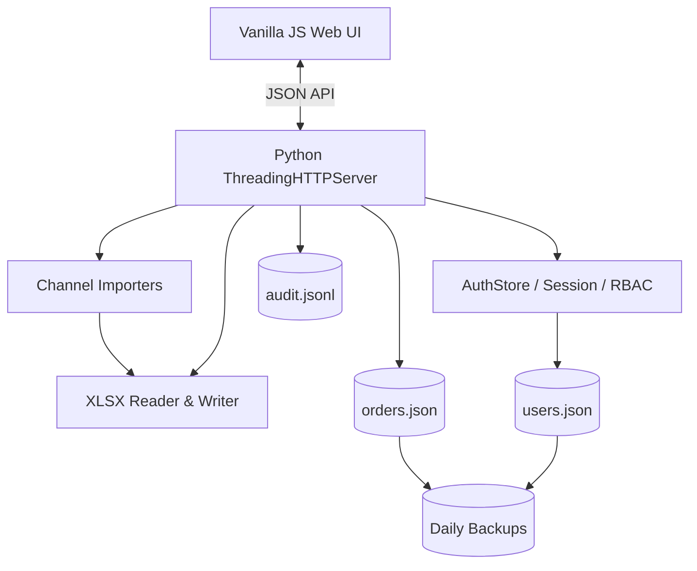

# Order Workflow

> 여러 판매 채널의 주문 파일을 하나로 통합하고, 제작부터 출고와 고객 이력 조회까지 연결한 사내 주문 처리 웹 애플리케이션

[](https://www.python.org/)
[](#테스트)
[](#프로젝트-정보)

카카오, 쿠팡, 고도몰처럼 서로 다른 형식의 주문서를 표준 데이터로 변환하고, 여러 작업자가 제작 상태와 출고 이력을 함께 관리할 수 있도록 만든 프로젝트입니다.

단순한 주문 목록이 아니라 **파일 수집 → 중복 제거 → 작업 선점 → 제작 완료 → 출고 → 고객별 이력 조회**로 이어지는 실제 업무 흐름을 하나의 화면에 구현했습니다.

## 프로젝트 요약

| 항목 | 내용 |
| --- | --- |
| 개발 목적 | 수작업 엑셀 취합과 작업자 간 중복 처리 방지 |
| 주요 사용자 | 판매 담당자, 제작 작업자, 출고 담당자, AS 담당자, 관리자 |
| Backend | Python 표준 라이브러리 HTTP 서버 |
| Frontend | Vanilla JavaScript, HTML, CSS |
| Storage | JSON 파일 기반 영속 저장소 |
| Spreadsheet | 자체 XLSX 파서·생성기, LibreOffice 기반 XLS 변환 |
| Deployment | Linux systemd 서비스 |
| Test | Python `unittest`, API 통합 테스트 포함 |

## 화면

### 주문 작업실

판매 채널과 처리 상태를 한눈에 확인하고, 준비·제작·출고 상태를 같은 행에서 변경할 수 있습니다.


### 고객별 출고 이력

고객 이름이나 연락처로 출고된 제품, 관리번호, 제작 담당자와 출고 담당자를 조회합니다.


### 회원 및 권한 관리

관리자는 사용자 계정을 추가하고 역할, 활성 상태, 비밀번호를 관리할 수 있습니다.


> 화면의 주문과 고객 정보는 포트폴리오 촬영을 위해 만든 가상 데이터입니다.

## 해결하려던 문제

기존 주문 처리 방식에서는 다음 문제가 반복됐습니다.

- 채널마다 주문서 열 이름과 파일 형식이 달라 매번 수작업 정리가 필요했습니다.
- 여러 작업자가 같은 주문을 동시에 처리하거나 현재 담당자를 알기 어려웠습니다.
- 제작 완료와 출고 완료 기록이 분리되어 고객 문의 시 이력을 다시 찾아야 했습니다.
- 출고 엑셀을 여러 번 만들면 이미 처리한 주문이 중복 포함될 수 있었습니다.
- 주문 취소, 담당자, 처리 시각 같은 운영 기록이 일관되게 남지 않았습니다.

이 프로젝트에서는 채널별 데이터를 공통 주문 모델로 정규화하고 모든 상태 변경을 서버에서 검증하도록 구성했습니다.

## 핵심 기능

### 1. 주문 통합

- 카카오, 쿠팡, 고도몰 및 범용 주문 양식 자동 판별
- `.xlsx`, `.xls`, 여러 파일이 포함된 ZIP 업로드
- 채널·주문번호·상품 기준 중복 주문 제거
- 같은 업로드 묶음 안에서 발생하는 중복도 저장 전에 제거
- 고도몰 본상품과 추가상품을 하나의 주문으로 그룹화
- 수기 전화 주문 등록 및 주문번호 중복 검사
- 주문일시와 주문번호 기준 자연 정렬

### 2. 제작 및 출고

- 전체, 제작 대기, 준비 중, 제작 완료, 출고 완료 상태 필터
- 작업 선점과 담당자 표시를 통한 동시 작업 충돌 방지
- 제품 관리번호 등록 및 전체 주문 대상 중복 검사
- 제작·출고 담당자와 UTC 처리 시각 기록
- 제작 완료 전 출고 처리 차단
- 출고 완료 후 제작 상태 되돌리기 차단
- 금일 신규 출고 주문만 `.xlsx`로 생성
- 엑셀 생성 성공 후에만 주문을 보관 처리하여 데이터 유실 방지

### 3. 취소 및 고객 이력

- 역할별 주문 취소 권한 검증
- 취소 사유와 처리 담당자 기록
- 출고 완료 또는 보관 주문의 잘못된 취소 차단
- 고객 이름·연락처 기반 출고 이력 검색
- 제품 관리번호, 제작 담당자, 출고 담당자 통합 조회

### 4. 계정 및 권한

| 역할 | 주요 권한 |
| --- | --- |
| 총책임자 | 전체 기능, 회원 관리, 제작 완료 주문 취소 |
| 개발자 | 운영 지원과 회원 관리, 상위 관리자 계정 변경 제한 |
| 판매 담당자 / MD | 주문 등록, 파일 가져오기, 출고 처리, 주문 취소 |
| AS 담당자 | 주문 작업과 고객별 출고 이력 조회 |
| 일반 작업자 | 주문 조회, 준비·제작 상태 처리, 관리번호 등록 |

최초 실행 시 첫 계정만 총책임자로 생성되며, 동시에 여러 최초 계정이 만들어지지 않도록 서버 잠금을 적용했습니다.

## 업무 흐름


## 시스템 구조



## 주요 기술적 판단

### 프레임워크 없는 Python 서버

설치 환경을 단순하게 유지하기 위해 외부 웹 프레임워크 없이 Python 표준 라이브러리로 API와 정적 파일 서버를 구성했습니다. 배포 서버에서는 Python만으로 실행할 수 있습니다.

### 채널별 파서와 공통 모델 분리

각 판매 채널의 열 이름 차이는 `importers.py`에서 처리하고, 서버와 화면은 정규화된 공통 주문 구조만 사용합니다. 새 채널을 추가할 때 주문 처리 로직 전체를 변경하지 않아도 됩니다.

### 파일 저장의 안정성

데이터 변경 시 임시 파일에 먼저 기록하고 `fsync` 후 원본 파일을 원자적으로 교체합니다. 변경 전 데이터는 일별 백업으로 보관하며 기본 보존 기간은 14일입니다.

### 출고 엑셀의 트랜잭션 순서

엑셀 생성이 실패했는데 주문이 먼저 보관되는 문제를 막기 위해 다음 순서를 사용합니다.

1. 출고 대상 주문 조회
2. 메모리에서 XLSX 생성
3. 생성 성공 확인
4. 주문 보관 상태 저장
5. 생성한 파일 응답

### 서버 기준 작업자 정보

상태 변경 담당자는 브라우저가 보낸 이름을 신뢰하지 않고 인증된 세션의 사용자 이름으로 기록합니다. 이를 통해 작업자 기록 위변조 가능성을 줄였습니다.

## 보안과 데이터 보호

- PBKDF2-SHA256, 310,000회 반복 기반 비밀번호 해시
- 세션 토큰의 메모리 저장과 12시간 만료
- `HttpOnly`, `SameSite=Strict` 세션 쿠키
- 로그인 연속 실패 시 5분간 요청 제한
- 역할 기반 API 접근 제어
- 업로드 본문 30MB 제한
- ZIP 내부 파일 수와 압축 해제 크기 제한
- 주문, 계정, 감사 로그 파일 권한 `0600`
- 데이터 디렉터리와 백업 디렉터리 권한 `0700`
- 주문 등록, 상태 변경, 취소, 로그인 감사 로그
- 실제 운영 데이터와 백업 파일 Git 추적 제외

인터넷에 직접 공개할 경우에는 HTTPS 리버스 프록시를 구성하고 세션 쿠키에 `Secure` 속성을 적용해야 합니다.

## 테스트

```bash
python3 -m unittest discover -s test -v
```

현재 자동 테스트는 다음을 검증합니다.

- 비밀번호 해시와 세션 인증
- 역할별 API 권한
- 로그인 실패 제한
- 카카오·쿠팡·고도몰·범용 주문 가져오기
- HTML 형식의 `.xls` 처리
- ZIP 업로드 제한
- 기존 데이터 및 같은 업로드 내 중복 제거
- 수기 주문 등록과 중복 주문번호 차단
- 준비·제작·출고 상태 전이와 작업 충돌
- 관리번호 중복 검사
- 주문 취소와 보관 처리
- 출고 엑셀 생성 실패 시 데이터 보존
- 고객별 출고 이력 조회
- 일별 백업, 감사 로그, 파일 권한
- 비정상 요청 본문 길이 방어

```text
Ran 27 tests
OK (skipped=2)
```

선택 테스트 2개는 실제 수집 샘플과 LibreOffice가 있는 환경에서 실행합니다.

```bash
RUN_EXTERNAL_SAMPLE_TESTS=1 RUN_LIBREOFFICE_TESTS=1 \
python3 -m unittest discover -s test -v
```

## 실행 방법

### Linux / macOS

```bash
git clone https://github.com/jiyoon99/order-workflow-linux.git
cd order-workflow-linux
python3 src/server.py
```

### Windows

```powershell
git clone https://github.com/jiyoon99/order-workflow-linux.git
cd order-workflow-linux
py src/server.py
```

브라우저에서 `http://localhost:3000`을 열고 최초 관리자 계정을 생성합니다.

`.xlsx`는 Python만으로 처리할 수 있습니다. 구형 바이너리 `.xls` 파일을 가져오려면 서버에 LibreOffice가 설치되어 있어야 합니다.

## 환경변수

| 이름 | 기본값 | 설명 |
| --- | --- | --- |
| `PORT` | `3000` | HTTP 서버 포트 |
| `DATA_FILE` | `data/orders.json` | 주문 데이터 파일 |
| `USERS_FILE` | `data/users.json` | 사용자 데이터 파일 |
| `AUDIT_FILE` | `data/audit.jsonl` | 감사 로그 파일 |

## 프로젝트 구조

```text
order-workflow-linux/
├── docs/images/         # 포트폴리오 화면 이미지
├── public/
│   ├── index.html       # 화면 구조
│   ├── app.js           # 상태 관리와 API 연동
│   └── styles.css       # 반응형 업무 화면 스타일
├── src/
│   ├── server.py        # HTTP API와 주문 상태 처리
│   ├── auth.py          # 계정, 비밀번호, 세션, 권한
│   ├── importers.py     # 채널별 주문 정규화
│   └── excel.py         # XLSX 읽기와 생성
├── test/                # 단위 및 HTTP 통합 테스트
├── deploy/              # systemd와 시작 스크립트
└── data/                # 로컬 운영 데이터, Git 추적 제외
```

## 현재 한계와 개선 계획

현재 버전은 소규모 사내 운영을 기준으로 설계했습니다.

- JSON 저장소를 SQLite 또는 PostgreSQL로 전환
- 공개 회원가입 대신 관리자 초대·승인 방식 적용
- HTTPS 환경의 `Secure` 쿠키와 CSRF 방어 강화
- 주문 변경 이력 조회와 특정 시점 복구 기능
- Playwright 기반 브라우저 E2E 테스트
- CI에서 테스트, 정적 검사, 배포 패키지 검증 자동화
- 주문량과 처리 시간 통계 대시보드

## 프로젝트 정보

실제 운영 과정에서 발생한 주문 취합과 제작·출고 협업 문제를 해결하기 위해 개발했습니다. 공개 저장소에는 개인정보, 실제 주문 데이터, 계정 정보와 감사 로그를 포함하지 않습니다.

Repository: [github.com/jiyoon99/order-workflow-linux](https://github.com/jiyoon99/order-workflow-linux)
