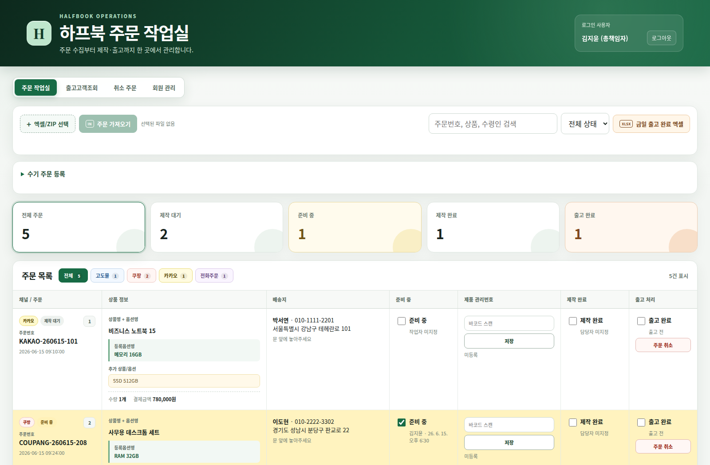
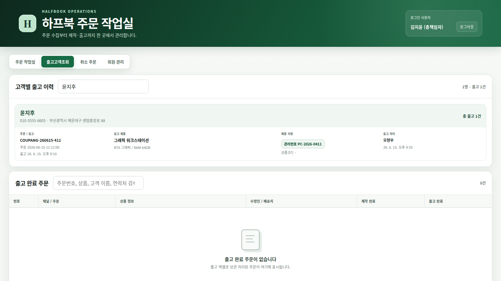
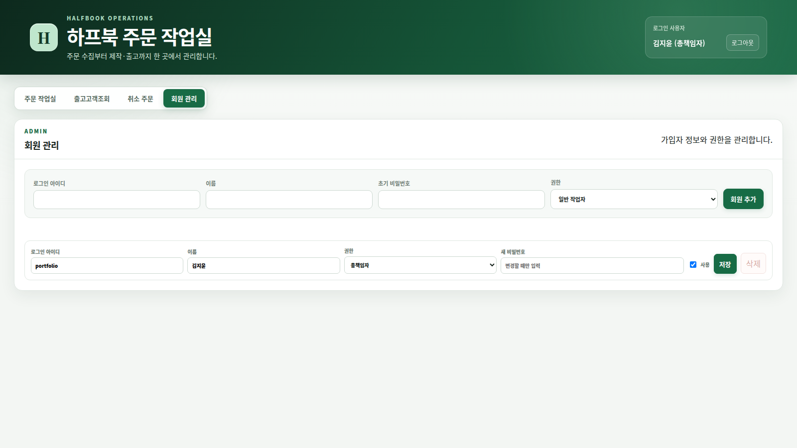

# Windows Order Workflow

Windows 환경에서 주문 엑셀을 가져오고, 제작 상태·SW 검수·출고 확인·취소 주문·고객별 출고 이력을 관리하는 로컬 주문 운영 웹 애플리케이션입니다.

실제 주문/회원 데이터는 로컬 `data/`에만 저장하고 GitHub에는 포함하지 않도록 구성했습니다.



## What I Built / 만든 것

쇼핑몰·전화·방문 주문을 한 화면에서 관리할 수 있도록 만든 주문 작업장입니다. 주문 가져오기, 중복 방지, 수기 주문 등록, 제작 단계 체크, SW 검수, 출고 엑셀 생성, 취소 주문 보관, 고객별 출고 이력 조회까지 작업 흐름을 하나로 묶었습니다.

운영자가 별도 서버나 DB 설치 없이 Windows PC에서 바로 실행할 수 있도록 Python 표준 라이브러리 기반 HTTP 서버와 정적 프론트엔드로 구성했습니다.

## Workflow / 작업 흐름

```text
엑셀/ZIP 주문 가져오기
    ↓
기존 주문과 중복 검사
    ↓
준비 중 / 제작 완료 / SW 검수 체크
    ↓
제품 관리번호 입력
    ↓
출고 확인
    ↓
출고 엑셀 생성 및 고객별 출고 이력 보관
```

수기 전화·방문 주문은 별도 입력 폼에서 등록하고 같은 작업 흐름으로 처리합니다.

## Main Features / 주요 기능

- 엑셀 또는 ZIP 주문 파일 가져오기
- 기존 주문, 출고 완료 주문, 취소 주문 기준 중복 방지
- 같은 주문번호의 배송지 변경 감지
- 전화·방문 수기 주문 등록
- 주문 상세 정보 수정
- 준비 중, 제작 완료, SW 검수, 출고 확인 단계 관리
- 제품 관리번호 다중 입력 및 수량 대비 입력 개수 표시
- 금일 출고 확인 주문 XLSX 내보내기
- 취소 주문 보관함 분리
- 고객 이름·연락처 기반 출고 이력 조회
- 회원가입, 로그인, 역할 기반 권한 관리
- 다크 모드 UI
- 감사 로그와 일별 백업 생성
- 주문/회원/감사 로그 파일 Git 제외

## Role-Based Access / 권한 관리

| 역할 | 주요 권한 |
| --- | --- |
| `owner` | 전체 관리, 회원 관리, 주문 관리 |
| `developer` | 개발자 관리 권한, 회원 관리 |
| `as_manager` | AS 이력 조회, 주문 상태 일부 처리 |
| `sales_manager` | 주문 등록·수정·출고 처리 |
| `md` | 주문 등록·수정·출고 처리 |
| `worker` | 일반 작업 상태 처리 |

권한에 따라 회원 관리, 주문 가져오기, 수기 주문 등록, 취소, 출고 엑셀 생성 접근을 제한합니다.

## Development / 개발 방식

```text
브라우저 UI
    ↓ fetch API
Python HTTP handler
    ↓
권한 검사 / 입력 검증 / 중복 판정
    ↓
JSON 파일 저장 + 감사 로그 기록
    ↓
XLSX import/export
```

- 별도 웹 프레임워크 없이 `http.server`와 정적 파일로 동작하도록 구성했습니다.
- 주문 저장은 임시 파일에 먼저 쓴 뒤 교체해 저장 중 손상 가능성을 줄였습니다.
- 주문과 사용자 파일은 일별 백업을 남기고 오래된 백업은 정리합니다.
- 파일 쓰기와 감사 로그 기록은 lock으로 보호합니다.
- 로그인 실패가 반복되면 일정 시간 차단합니다.
- 비밀번호는 PBKDF2 해시로 저장합니다.
- 실제 운영 데이터는 `.gitignore`로 제외해 포트폴리오 저장소에 올라가지 않도록 했습니다.

## Tech Stack / 기술 스택

| 영역 | 기술 |
| --- | --- |
| Backend | Python standard library, `http.server` |
| Frontend | HTML, CSS, Vanilla JavaScript |
| Data | Local JSON files, JSONL audit log |
| Excel | Custom XLSX read/write utilities |
| Auth | PBKDF2 password hashing, in-memory sessions |
| Test | Python `unittest` |
| Platform | Windows Batch, PowerShell |

## Screenshots / 화면

### Dashboard / 주문 작업장


### Customer History / 고객별 출고 이력



### Member Management / 회원 관리



## Run / 실행

Windows:

```bat
start-server.bat
```

또는 PowerShell:

```powershell
.\start-server.ps1
```

브라우저에서 접속합니다.

```text
http://localhost:3000
```

서버 종료:

```bat
stop-server.bat
```

또는:

```powershell
.\stop-server.ps1
```

직접 실행:

```powershell
py src/server.py
```

## Test / 테스트

```powershell
python -m unittest discover -s test -v
```

현재 검증 결과:

```text
Ran 41 tests
OK (skipped=2)
```

스킵된 테스트는 외부 샘플 파일 또는 LibreOffice가 있을 때 실행하는 선택 테스트입니다.

## Environment / 환경 변수

| 이름 | 기본값 | 설명 |
| --- | --- | --- |
| `PORT` | `3000` | HTTP 포트 |
| `HOST` | `0.0.0.0` | 바인드 주소 |
| `DATA_FILE` | `data/orders.json` | 주문 데이터 파일 |
| `USERS_FILE` | `data/users.json` | 사용자 데이터 파일 |
| `AUDIT_FILE` | `data/audit.jsonl` | 감사 로그 파일 |

## Data Safety / 데이터 보호

다음 런타임 데이터는 Git에 포함하지 않습니다.

- `data/orders.json`
- `data/users.json`
- `data/audit.jsonl`
- `data/backups/`
- `*.log`
- `*.pid`

실제 고객 정보, 주문 정보, 계정 정보가 공개 저장소에 올라가지 않도록 분리했습니다.

## Repository Structure / 저장소 구조

```text
order-workflow-sample/
├── public/
│   ├── index.html
│   ├── app.js
│   └── styles.css
├── src/
│   ├── server.py
│   ├── importers.py
│   ├── excel.py
│   └── auth.py
├── test/
│   ├── test_auth.py
│   ├── test_importers.py
│   └── test_server.py
├── docs/images/
├── start-server.bat
├── start-server.ps1
├── stop-server.bat
├── stop-server.ps1
└── README.md
```

## License / 라이선스

Portfolio sample project. Runtime customer/order/account data is not included.
