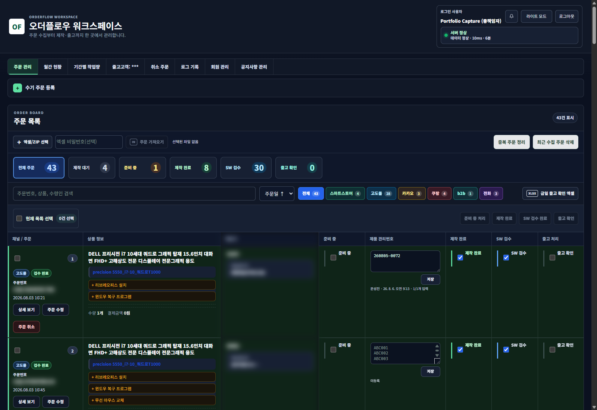
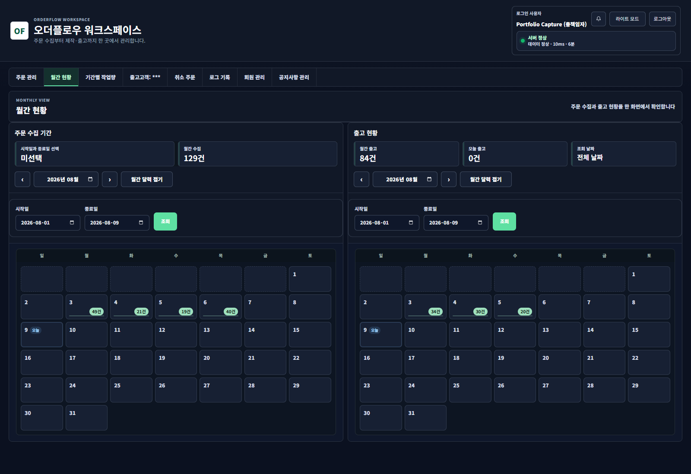
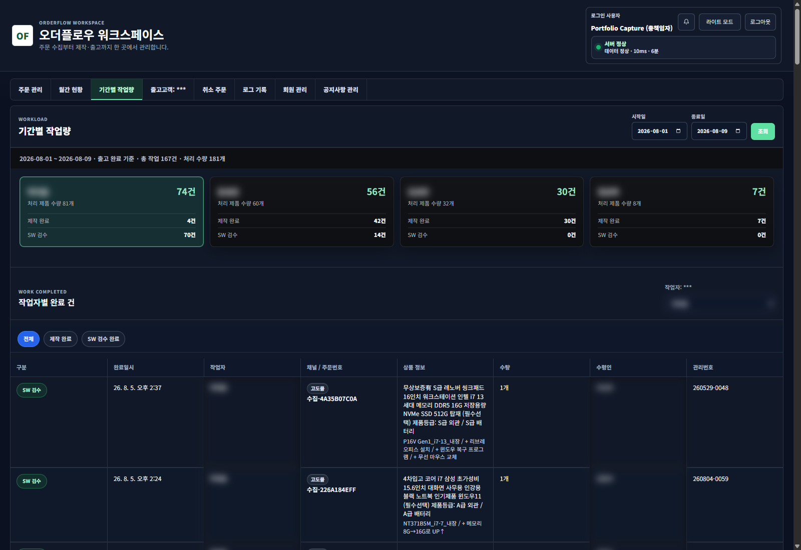
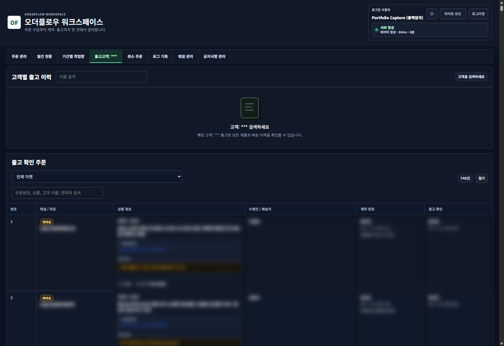
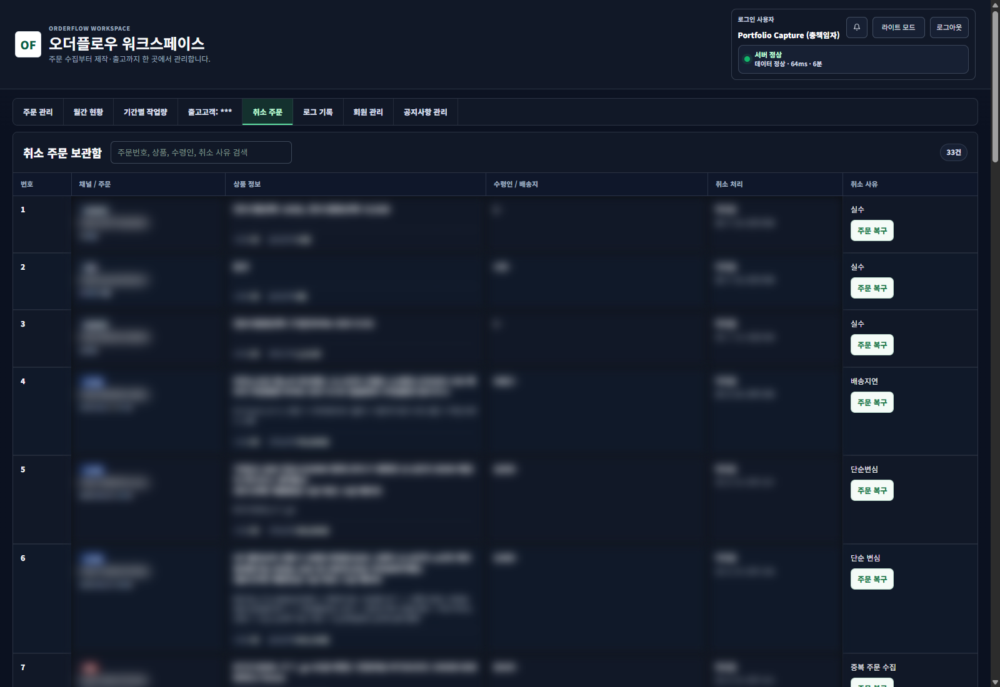
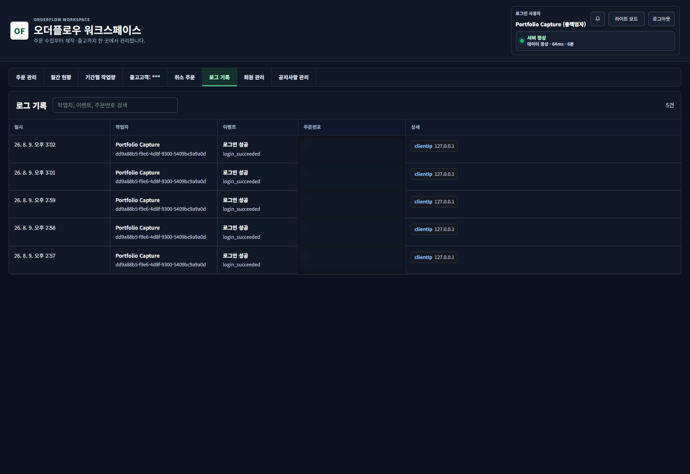
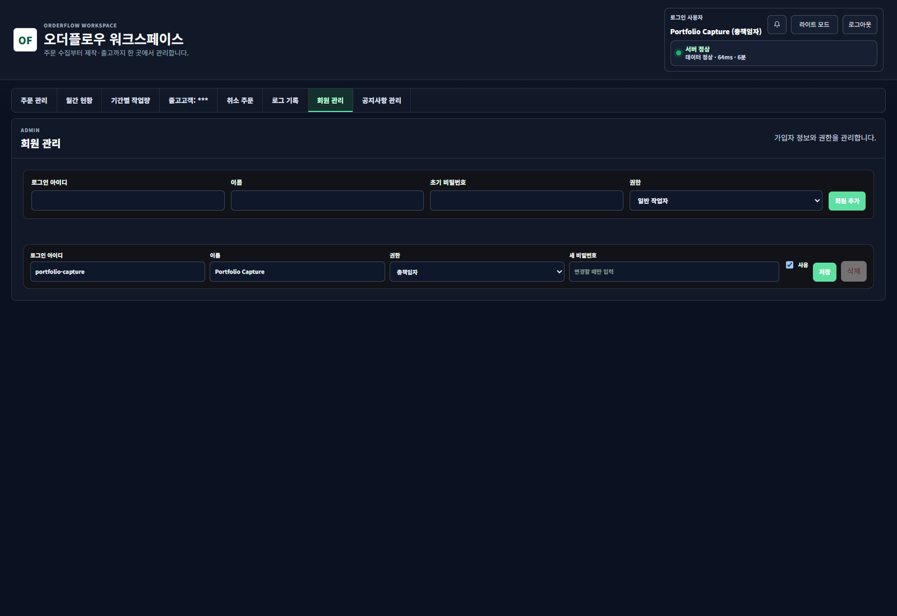
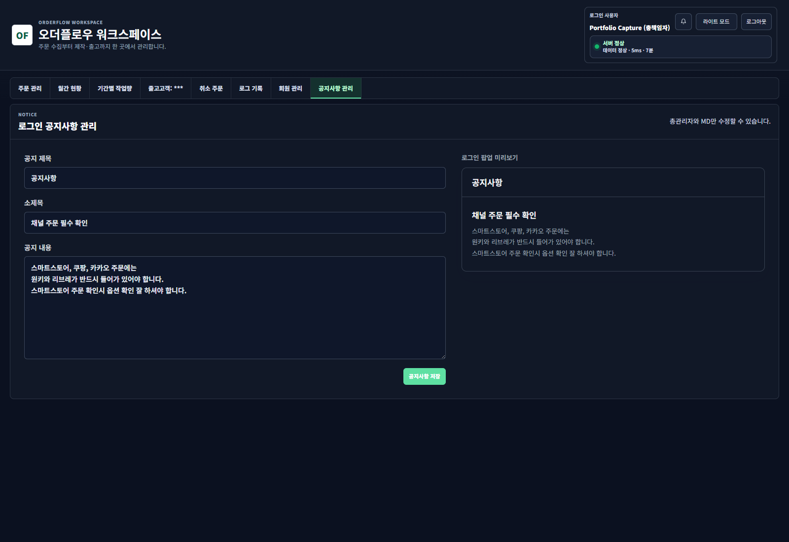

# 오더플로우 워크스페이스

여러 판매 채널의 주문을 한 곳으로 모아 **수집, 중복 검수, 제작 진행, SW 검수, 출고 확인, 취소 보관, 고객 이력 조회**까지 처리하는 Windows 기반 로컬 주문 운영 시스템입니다.

실제 운영 데이터를 연결해 실행한 화면을 캡처했습니다. 공개 저장소에 올리는 이미지라 고객명, 연락처, 주소, 작업자명 등 민감 정보는 마스킹했습니다.



## 프로젝트 목적

기존 주문 처리는 채널별 엑셀 파일, 수기 주문, 제작 상태 체크, 관리번호 입력, 출고 확인이 분리되어 있어 담당자 간 확인 비용이 컸습니다. 이 프로젝트는 주문 운영자가 하루 업무를 하나의 화면에서 끝낼 수 있도록 만든 내부 운영 도구입니다.

핵심 목표는 세 가지였습니다.

- 주문 누락과 중복 등록을 줄이는 수집/검수 흐름
- 제작, 검수, 출고 담당자의 작업 기록 자동화
- 고객 문의 대응을 위한 출고 이력과 취소 주문 보관

## 실제 운영 화면

### 1. 주문 운영 보드


주문 상태 카드, 채널 필터, 검색, 엑셀/ZIP 업로드, 수기 주문 등록, 관리번호 입력, 제작 단계 체크, 출고 처리를 한 화면에 배치했습니다. 운영자가 주문 목록을 보면서 바로 상태를 바꿀 수 있도록 테이블형 UI로 설계했습니다.

이 화면에서 확인할 수 있는 기능:

- 전체 주문, 제작 대기, 준비 중, 제작 완료, SW 검수, 출고 완료 카운트
- 카카오, 쿠팡, 스마트스토어, 고도몰 등 채널별 필터
- 주문번호, 상품명, 수령인 기준 검색
- 엑셀/XLS/ZIP 주문 파일 업로드
- 전화/방문 주문 수기 등록
- 상품 관리번호 입력 및 저장
- 단계별 체크 담당자와 처리 시간 기록
- 금일 출고 완료 엑셀 내보내기

### 2. 월간 현황



주문 수집 기간과 출고 기간을 월 단위로 확인합니다. 운영자가 월간 수집량과 출고량을 빠르게 비교하고 날짜별 상세 조회로 이어갈 수 있도록 구성했습니다.

이 화면에서 확인할 수 있는 기능:

- 월간 주문 수집 건수
- 월간 출고 건수
- 오늘 출고 건수
- 조회 기간 직접 선택
- 월간 달력 기반 날짜별 흐름 확인

### 3. 기간별 작업량



출고 완료된 주문을 기준으로 작업자별 제작 완료와 SW 검수 처리량을 집계합니다. 담당자별 작업량을 비교하고 특정 작업자의 완료 건 목록까지 확인할 수 있습니다.

이 화면에서 확인할 수 있는 기능:

- 기간별 작업량 집계
- 작업자별 처리 건수와 처리 수량
- 제작 완료/SW 검수 단계별 집계
- 작업자 선택 후 상세 완료 건 조회
- 채널, 주문번호, 상품, 수량, 관리번호 확인

### 4. 고객별 출고 이력



출고 완료된 주문을 고객 이름과 연락처 기준으로 다시 찾을 수 있습니다. 고객 문의가 들어왔을 때 과거 출고 상품, 출고일, 관리번호, 배송 정보를 빠르게 확인하는 용도입니다.

이 화면에서 확인할 수 있는 기능:

- 고객명/연락처 기반 출고 이력 조회
- 출고 완료 주문 보관
- 주문번호, 채널, 상품 정보 확인
- 관리번호와 출고 처리 기록 확인
- AS 담당자 권한 기반 조회 제어

### 5. 취소 주문 보관함



취소된 주문은 활성 주문 목록에서 분리하고 별도 보관함에 남깁니다. 취소 사유와 처리 담당자를 기록해 주문 복구나 고객 문의 대응이 가능하도록 했습니다.

이 화면에서 확인할 수 있는 기능:

- 취소 주문 별도 목록 관리
- 주문번호, 채널, 상품 정보 확인
- 취소 처리자와 처리 시각 기록
- 취소 사유 보관
- 필요 시 주문 복구

### 6. 감사 로그



로그인, 주문 변경, 출고 처리 등 주요 이벤트를 감사 로그로 남깁니다. 운영 중 누가 어떤 변경을 했는지 추적할 수 있도록 작업자, 이벤트, 주문번호, 상세 정보를 분리해 기록합니다.

이 화면에서 확인할 수 있는 기능:

- 로그인 성공/실패 기록
- 주문 변경 이벤트 기록
- 작업자와 이벤트 종류 검색
- 주문번호 기반 로그 조회
- 상세 메타데이터 확인

### 7. 회원 및 권한 관리



운영 역할에 따라 접근 가능한 기능을 나눴습니다. 총책임자, 개발자, AS 담당, 영업 담당, MD, 작업자 역할을 구분해 주문 수정, 회원 관리, 취소 처리, 감사 로그 조회 같은 기능을 제한합니다.

이 화면에서 확인할 수 있는 기능:

- 회원 생성, 수정, 비활성화
- 역할별 권한 지정
- 비밀번호 재설정
- 운영자/개발자/작업자 권한 분리
- 관리자 기능 접근 제한

### 8. 공지사항 관리



로그인 후 운영자가 반드시 확인해야 하는 채널 주문 규칙이나 당일 공지를 관리합니다. 공지는 로그인 화면과 작업 화면에서 확인할 수 있도록 분리했습니다.

이 화면에서 확인할 수 있는 기능:

- 로그인 공지 제목/강조 문구/본문 수정
- 채널 주문 필수 확인 사항 관리
- 공지 미리보기
- MD와 총책임자 중심의 수정 권한 제어

## 전체 기능 맵

| 구분 | 구현 기능 |
| --- | --- |
| 주문 수집 | 엑셀, XLS, ZIP 업로드, 채널별 주문 파싱, 암호화 엑셀 복호화 지원 |
| 중복 방지 | 주문번호 기준 중복 제거, 수령인/연락처/주소/상품 기반 중복 판정, 출고 완료 주문 재수집 방지 |
| 배송지 변경 | 같은 주문번호의 배송지 변경 감지, 기존 주문과 신규 주문 병합 |
| 수기 주문 | 전화, 방문, 제품 교환 등 파일 없이 들어온 주문 등록 및 수정 |
| 작업 상태 | 준비 중, 제작 완료, SW 검수 완료, 출고 확인 단계별 체크 |
| 작업 기록 | 처리 담당자, 처리 시간, 단계별 작업 이력 저장 |
| 관리번호 | 상품 관리번호 다중 입력, 주문 수량 대비 입력 개수 표시 |
| 출고 처리 | 금일 출고 완료 엑셀 내보내기, 출고 완료 주문 보관 |
| 고객 대응 | 고객별 출고 이력 조회, AS 담당 권한 조회 |
| 취소 관리 | 취소 주문 분리 보관, 활성 주문 목록에서 제외 |
| 통계 | 월간 현황, 날짜별 주문 조회, 기간별 작업량 집계 |
| 알림/공지 | 로그인 공지사항, 운영 알림, 공지 관리 |
| 보안 | 로그인, 회원가입, PBKDF2 비밀번호 해시, 세션 토큰, 로그인 실패 제한 |
| 권한 | owner, developer, as_manager, sales_manager, md, worker 역할 분리 |
| 감사 로그 | 로그인, 주문 변경, 출고 처리 등 주요 이벤트 기록 |
| 운영 자동화 | Windows Batch/PowerShell 실행, 종료, 서버 제어, 24시간 워치독 스크립트 |
| 데이터 보호 | 실제 주문/회원/감사 로그는 Git 제외, 로컬 JSON과 백업으로 관리 |

## 업무 흐름

```text
채널별 주문 파일 수집
  -> 엑셀/XLS/ZIP 업로드
  -> 주문 파싱 및 중복 검사
  -> 주문 보드 등록
  -> 준비 중 체크
  -> 제작 완료 체크
  -> SW 검수 완료 체크
  -> 관리번호 저장
  -> 출고 확인
  -> 출고 이력/감사 로그/백업 보관
```

취소 주문과 수기 주문은 같은 보드에서 처리하되, 운영 이력이 남도록 별도 상태와 기록을 저장합니다.

## 기술적 구현 포인트

- Python 표준 라이브러리 `http.server` 기반의 경량 HTTP 서버
- 프레임워크 없는 Vanilla JavaScript SPA 구조
- 로컬 JSON 파일 기반 주문/회원/공지 저장
- JSONL 기반 감사 로그 기록
- PBKDF2 기반 비밀번호 해싱
- 파일 저장 시 임시 파일 교체 방식으로 데이터 손상 가능성 감소
- 주문 파일 업로드 용량/개수 제한
- ZIP 내부 엑셀 파일 개수와 압축 해제 크기 제한
- Windows 로컬 실행을 위한 Batch/PowerShell 스크립트 제공
- Excel 복호화 처리를 위해 필요한 패키지를 `src/_vendor`에 포함
- `unittest` 기반 주문 파싱, 권한, 중복 처리, 서버 API 테스트 구성

## 기술 스택

| 영역 | 사용 기술 |
| --- | --- |
| Backend | Python 3.12, standard library, `http.server` |
| Frontend | HTML, CSS, Vanilla JavaScript |
| Data | Local JSON, JSONL audit log |
| Excel | XLSX read/write utility, msoffcrypto, olefile |
| Auth | PBKDF2 password hashing, session token |
| Test | Python `unittest` |
| Platform | Windows Batch, PowerShell |

## 실행 방법

Python 3.12 이상이 설치된 Windows 환경에서 실행합니다.

```powershell
.\start-server.ps1
```

또는 배치 파일로 실행합니다.

```bat
start-server.bat
```

브라우저에서 접속합니다.

```text
http://localhost:3000
```

최초 접속 시 관리자 계정을 생성한 뒤 로그인합니다. 서버 종료는 아래 명령을 사용합니다.

```powershell
.\stop-server.ps1
```

직접 실행도 가능합니다.

```powershell
python src/server.py
```

## 테스트

```powershell
python -m unittest discover -s test -v
```

현재 확인한 테스트 결과:

```text
Ran 60 tests
OK (skipped=2)
```

일부 Excel 관련 테스트는 외부 샘플 파일 또는 LibreOffice 설치 여부에 따라 건너뜁니다.

## 데이터 보호

실제 운영 데이터는 GitHub에 포함하지 않습니다.

- `data/orders.json`
- `data/users.json`
- `data/audit.jsonl`
- `data/login-notice.json`
- `data/backups/`
- `*.log`
- `*.pid`
- `.runtime/`

공개 저장소에는 코드, 운영 스크립트, 포트폴리오용 화면 캡처만 포함합니다.

## 저장소 구조

```text
order-workflow-sample/
├─ public/              # 브라우저 UI
├─ src/                 # Python HTTP 서버, 인증, 주문 처리, Excel 유틸
├─ src/orders/          # 주문 중복 정리 및 가져오기 서비스
├─ src/_vendor/         # Excel 복호화용 vendored 패키지
├─ test/                # unittest 기반 테스트
├─ docs/images/         # 실제 운영 화면 캡처
├─ deploy/              # Linux 서비스 예시
├─ tools/               # 운영 보조 스크립트
├─ start-server.ps1
├─ stop-server.ps1
└─ README.md
```

## 포트폴리오 요약

이 프로젝트는 단순 주문 CRUD가 아니라 실제 운영자가 매일 반복하는 주문 처리 업무를 기준으로 설계한 내부 운영 시스템입니다. 주문 파일 수집, 중복 판단, 상태 처리, 작업자 기록, 권한 관리, 고객 이력, 엑셀 내보내기, 감사 로그, Windows 장시간 실행 스크립트까지 운영에 필요한 기능을 한 프로젝트 안에 통합했습니다.
