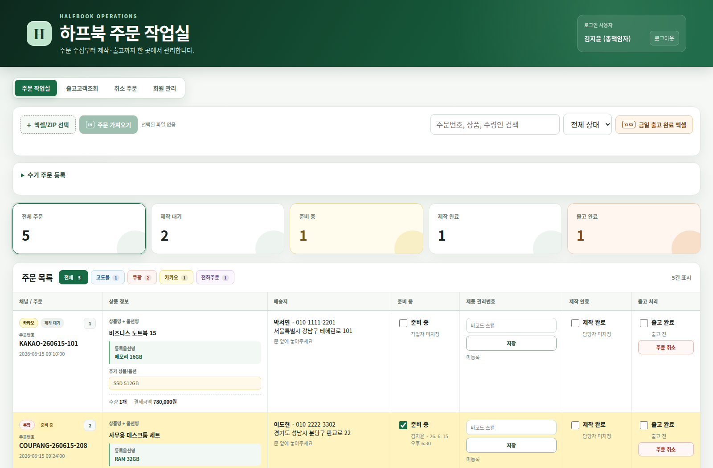
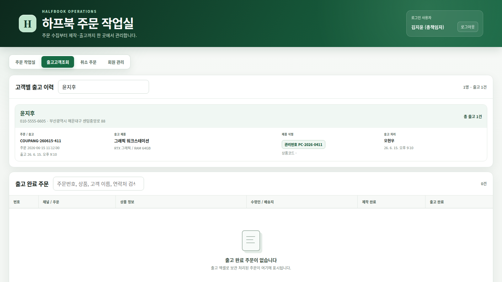
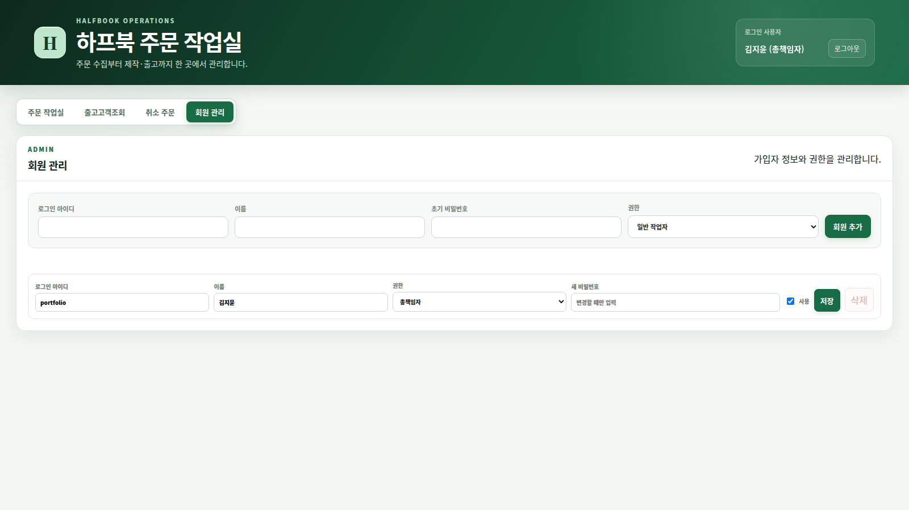

# 오더플로우 워크스페이스

Windows PC에서 주문 수집, 제작 상태 체크, SW 검수, 출고 확인, 취소 주문, 고객별 출고 이력까지 한 화면에서 처리하도록 만든 로컬 주문 운영 시스템입니다.

실제 운영 데이터는 `data/`에만 저장하고 GitHub에는 포함하지 않도록 분리했습니다. 포트폴리오에는 샘플 화면과 코드 구조만 공개합니다.



## 프로젝트 개요

여러 판매 채널에서 들어오는 주문을 엑셀 또는 ZIP 파일로 가져온 뒤, 중복 주문을 걸러내고 제작·검수·출고 단계별로 작업자를 기록하는 업무용 웹 애플리케이션입니다.

별도 DB 서버나 프레임워크 없이 Python 표준 라이브러리 기반 HTTP 서버와 Vanilla JavaScript UI로 구성했습니다. Windows 환경에서 배치 파일 또는 PowerShell 스크립트로 바로 실행할 수 있고, 운영 데이터는 로컬 JSON 파일로 관리합니다.

## 주요 기능

- 엑셀/XLS/ZIP 주문 파일 가져오기
- 기존 주문, 출고 완료 주문, 취소 주문 기준 중복 방지
- 같은 주문번호의 배송지 변경 감지 및 병합 처리
- 전화·방문 등 수기 주문 등록 및 수정
- 준비 중, 제작 완료, SW 검수 완료, 출고 확인 단계 관리
- 상품 관리번호 다중 입력 및 수량 대비 입력 개수 표시
- 금일 출고 완료 주문 XLSX 내보내기
- 취소 주문 별도 보관 및 조회
- 고객 이름·연락처 기반 출고 이력 조회
- 월간 현황, 날짜별 주문, 기간별 작업량 통계
- 로그인, 회원가입, 역할 기반 권한 관리
- 공지사항 관리, 감사 로그, 로그인 실패 제한
- Windows 24시간 실행용 서버 제어/워치독 스크립트

## 화면

### 주문 운영 보드


주문 상태, 채널 필터, 검색, 일괄 처리, 관리번호 입력, 출고 확인을 한 화면에서 처리합니다.

### 고객별 출고 이력



수령인과 연락처 기준으로 과거 출고 내역을 빠르게 확인할 수 있습니다.

### 회원 및 권한 관리



운영자, 개발자, AS 담당, 영업 담당, MD, 작업자 역할을 나누고 기능 접근을 제한합니다.

## 작업 흐름

```text
주문 파일 업로드
  -> 주문 파싱 및 중복 검사
  -> 주문 목록 등록
  -> 준비 중 / 제작 완료 / SW 검수 완료 체크
  -> 관리번호 저장
  -> 출고 확인
  -> 고객별 출고 이력 및 작업 로그 보관
```

## 기술 스택

| 영역 | 사용 기술 |
| --- | --- |
| Backend | Python standard library, `http.server` |
| Frontend | HTML, CSS, Vanilla JavaScript |
| Data | Local JSON files, JSONL audit log |
| Excel | 자체 XLSX read/write 유틸리티, vendored Excel 복호화 패키지 |
| Auth | PBKDF2 password hashing, session token |
| Test | Python `unittest` |
| Platform | Windows Batch, PowerShell |

## 실행 방법

Python 3.12 이상이 설치된 Windows 환경에서 실행합니다.

```powershell
.\start-server.ps1
```

또는 배치 파일로 실행합니다.

```bat
start-server.bat
```

브라우저에서 접속합니다.

```text
http://localhost:3000
```

최초 접속 시 관리자 계정을 생성한 뒤 로그인합니다. 서버 종료는 아래 명령을 사용합니다.

```powershell
.\stop-server.ps1
```

직접 실행도 가능합니다.

```powershell
python src/server.py
```

## 테스트

```powershell
python -m unittest discover -s test -v
```

일부 Excel 관련 테스트는 샘플 파일 또는 LibreOffice 설치 여부에 따라 건너뜁니다.

## 데이터 보호

다음 운영 파일은 공개 저장소에 포함하지 않습니다.

- `data/orders.json`
- `data/users.json`
- `data/audit.jsonl`
- `data/backups/`
- `*.log`
- `*.pid`
- `.runtime/`

실제 고객 정보, 주문 정보, 계정 정보는 로컬 실행 환경에만 남도록 분리했습니다.

## 저장소 구조

```text
order-workflow-sample/
├─ public/              # 브라우저 UI
├─ src/                 # Python HTTP 서버, 인증, 주문 처리, Excel 유틸
├─ src/orders/          # 주문 중복 정리 및 가져오기 서비스
├─ test/                # unittest 기반 테스트
├─ docs/images/         # 포트폴리오 스크린샷
├─ deploy/              # Linux 서비스 예시
├─ tools/               # 운영 보조 스크립트
├─ start-server.ps1
├─ stop-server.ps1
└─ README.md
```

## 포트폴리오 포인트

이 프로젝트는 주문 처리 업무에서 반복되는 수작업을 줄이는 데 초점을 맞췄습니다. 단순 CRUD가 아니라 파일 업로드, 중복 판단, 역할별 권한, 작업 단계 기록, 엑셀 내보내기, 감사 로그, 로컬 운영 스크립트까지 실제 운영 흐름을 기준으로 구현했습니다.
